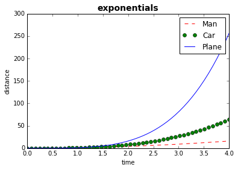
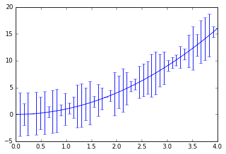
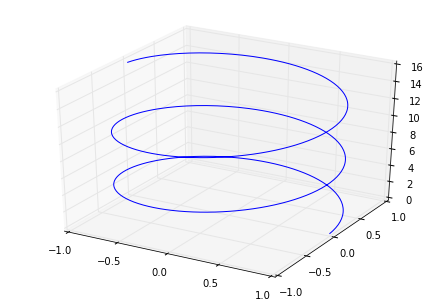
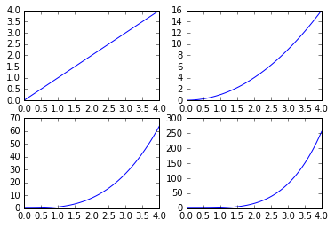

```python
import matplotlib.pyplot as plt
import numpy as np
```

# Plot


```python
%matplotlib inline
xs = np.linspace(0,4)
plt.plot(xs, xs**2, 'r--', label='Man')
plt.plot(xs, xs**3, 'go', label='Car')
plt.plot(xs, xs**4, 'b', label='Plane')

# legend
plt.legend()

# axis
ax = plt.gca()
ax.set_title("exponentials", size=14, weight='bold')
ax.set_xlabel("time")
ax.set_ylabel("distance")
```


    <matplotlib.text.Text at 0x10d40a898>





# Error bars


```python
# error bars
yerr = np.random.random_integers(-4,4,xs.shape)
plt.errorbar(xs, xs**2, yerr=yerr)
```


    <Container object of 3 artists>





# 3D Plots


```python
from mpl_toolkits.mplot3d import Axes3D
```


```python
fig = plt.figure()
ax = Axes3D(fig)
t = np.linspace(0, 5*np.pi, 501)
ax.plot(np.cos(t), np.sin(t), t)
```


    [<mpl_toolkits.mplot3d.art3d.Line3D at 0x10df3fa20>]





# Subplots


```python
# plt.subplot(rows, columns, active)
plt.subplot(2,2,1)
plt.plot(xs, xs)
plt.subplot(2,2,2)
plt.plot(xs, xs**2)
plt.subplot(2,2,3)
plt.plot(xs, xs**3)
plt.subplot(2,2,4)
plt.plot(xs, xs**4)
```


    [<matplotlib.lines.Line2D at 0x10e3cec18>]




